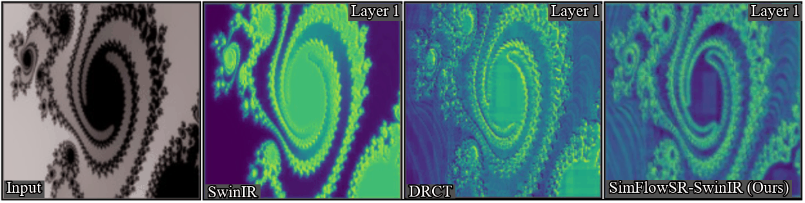
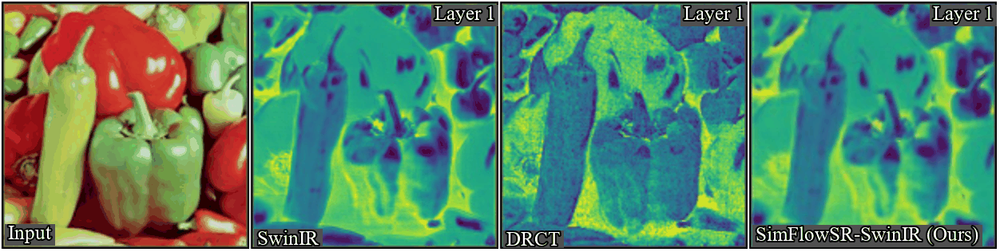

<div align="center">

# SimFlowSR: Self-similarity Aggregation over Consistent Information Flow for Single Image Super-Resolution


## [[Paper Link]](https://arxiv.org/abs/XXXX.XXXXX) [[Project Page]](https://ming053l.github.io/SimFlowSR/) [[Model zoo]](https://drive.google.com/drive/folders/XXXXX) [[Visual Results]](https://drive.google.com/drive/folders/XXXXX)

[Chia-Ming Lee](https://ming053l.github.io/), [Chih-Chung Hsu](https://cchsu.info/)

National Yang Ming Chiao Tung University, National Cheng Kung University

</div>

<div align="center">
  
## Overview

  
  
  
**TL;DR:** SimFlowSR combines consistent information flow with parameter-free self-similarity aggregation for state-of-the-art super-resolution with highest efficiency.

</div>


- **Background and Motivation**

Single image super-resolution requires both stable feature propagation and effective high-frequency detail recovery. Existing methods struggle with: (1) unstable activation dynamics causing information bottlenecks in deep layers, (2) limited high-frequency detail preservation despite consistent information flow, and (3) high computational overhead from complex attention mechanisms.

- **Main Contribution**

SimFlowSR addresses these challenges through **dual-branch cooperative architecture**:

1. **CEB (Contextual Encoding Branch)** - Dense-residual connections for consistent information flow, stabilizing inter-layer activation dynamics and maintaining smooth spatial information transmission.

2. **GAB (Geometric Aggregation Branch)** - Parameter-free geometric transformations via dihedral group D₄ (rotation, flipping) for self-similarity aggregation, enhancing high-frequency detail recovery without additional learnable parameters.

**Benchmark results on image super-resolution (×4).**

| Model | Params | FLOPs | Set5 | Set14 | BSD100 | Urban100 | Manga109 |
|:-----:|:------:|:-----:|:----:|:-----:|:------:|:--------:|:--------:|
| SwinIR | 11.90M | 45.65G | 32.92 | 29.09 | 27.92 | 27.45 | 32.03 |
| HAT | 20.77M | 104.22G | 33.04 | 29.23 | 28.00 | 27.97 | 32.48 |
| DRCT | 14.14M | 74.64G | 33.11 | 29.27 | 28.02 | 27.98 | 32.51 |
| MambaIR | 20.42M | 72.56G | 33.03 | 29.20 | 27.98 | 27.68 | 32.32 |
| **SimFlowSR-SwinIR** | **13.22M** | **58.76G** | **33.16** | **29.33** | **28.15** | **28.06** | **32.52** |
| **SimFlowSR-MambaIR** | **12.71M** | **59.30G** | **33.07** | **29.14** | **27.95** | **27.72** | **32.50** |

## Updates

- ✅ 2025-11-16: Project page released.
- ⏳ Code and pretrained models coming soon.

## Environment

- [PyTorch >= 1.7](https://pytorch.org/)
- [BasicSR == 1.3.4.9](https://github.com/XPixelGroup/BasicSR/blob/master/INSTALL.md)

### Installation
```bash
git clone https://github.com/ming053l/SimFlowSR.git
conda create --name simflowsr python=3.8 -y
conda activate simflowsr
conda install pytorch==1.12.1 torchvision==0.13.1 cudatoolkit=11.6 -c pytorch -c conda-forge
cd SimFlowSR
pip install -r requirements.txt
python setup.py develop
```

## How To Test
```bash
python simflowsr/test.py -opt options/test/SimFlowSR_SwinIR_test.yml
```

For MambaIR backbone:
```bash
python simflowsr/test.py -opt options/test/SimFlowSR_MambaIR_test.yml
```

## How To Train
```bash
CUDA_VISIBLE_DEVICES=0,1,2,3 python -m torch.distributed.launch --nproc_per_node=4 --master_port=4321 simflowsr/train.py -opt options/train/train_SimFlowSR_SwinIR.yml --launcher pytorch
```

For MambaIR backbone:
```bash
CUDA_VISIBLE_DEVICES=0,1,2,3 python -m torch.distributed.launch --nproc_per_node=4 --master_port=4321 simflowsr/train.py -opt options/train/train_SimFlowSR_MambaIR.yml --launcher pytorch
```

## Citations

If our work is helpful to your research, please kindly cite:
```bibtex
@article{lee2024simflowsr,
  title={SimFlowSR: Self-similarity Aggregation over Consistent Information Flow for Single Image Super-Resolution},
  author={Lee, Chia-Ming and Hsu, Chih-Chung},
  journal={arXiv preprint arXiv:XXXX.XXXXX},
  year={2024}
}
```

## Acknowledgments

Our work builds upon [SwinIR](https://github.com/JingyunLiang/SwinIR), [MambaIR](https://github.com/csguoh/MambaIR), [DRCT](https://github.com/ming053l/DRCT), and [BasicSR](https://github.com/XPixelGroup/BasicSR). We are grateful for their outstanding contributions.

## Contact

If you have any questions, please feel free to open an issue or contact us at [ming053l@gmail.com](mailto:ming053l@gmail.com).
