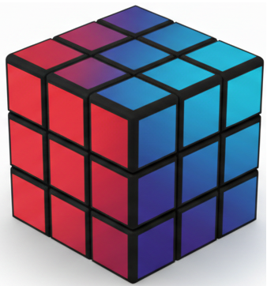
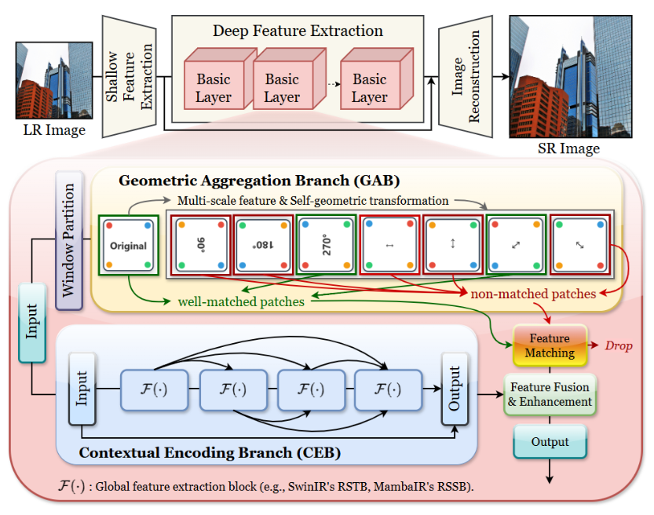
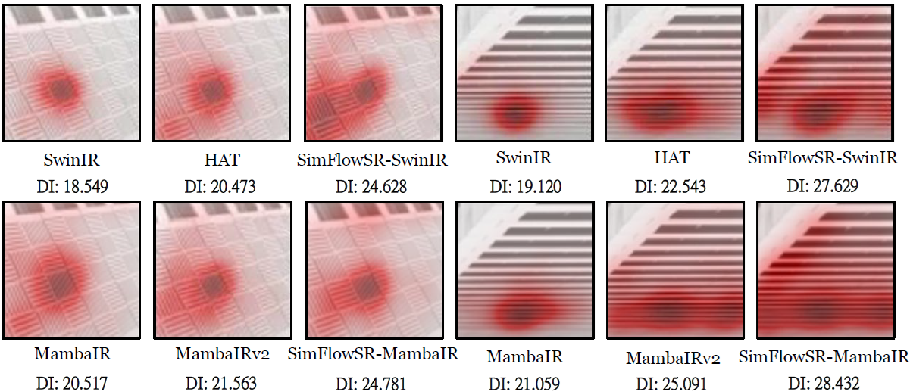
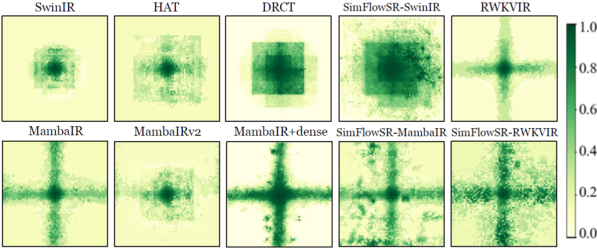

<div align="center">


#  SimFlowSR: Self-similarity Aggregation over Consistent Information Flow for Single Image Super-Resolution

[](https://arxiv.org/abs/XXXX.XXXXX)
[](https://ming053l.github.io/SimFlowSR/)
[](https://github.com/ming053l/SimFlowSR)

[Chia-Ming Lee](https://ming053l.github.io/)<sup>1,2</sup>, [Chih-Chung Hsu](https://cchsu.info/)<sup>1,2</sup>

<sup>1</sup>National Yang Ming Chiao Tung University, <sup>2</sup>National Cheng Kung University

</div>

---

## 📋 Overview

**TL;DR:** SimFlowSR integrates **CEB** (Contextual Encoding Branch) for consistent information flow with **GAB** (Geometric Aggregation Branch) for parameter-free self-similarity aggregation, achieving efficient high-fidelity super-resolution.

### Key Features

- 🎯 **Dual-Branch Design**: CEB stabilizes activation dynamics; GAB enhances high-frequency details
- ⚡ **High Efficiency**: Up to 37% fewer parameters with superior performance
- 🔧 **Plug-and-Play**: Seamlessly integrates into various backbones (SwinIR, MambaIR, RWKVIR)
- 🎨 **Parameter-Free**: GAB uses geometric transformations (dihedral group D₄) without learnable parameters

---

## 🚀 Performance

**Benchmark results on standard datasets (×4 super-resolution):**

| Model | Params | FLOPs | Set5 | Set14 | BSD100 | Urban100 | Manga109 |
|:-----:|:------:|:-----:|:----:|:-----:|:------:|:--------:|:--------:|
| SwinIR | 11.90M | 45.65G | 32.92 | 29.09 | 27.92 | 27.45 | 32.03 |
| HAT | 20.77M | 104.22G | 33.04 | 29.23 | 28.00 | 27.97 | 32.48 |
| DRCT | 14.14M | 74.64G | 33.11 | 29.27 | 28.02 | 27.98 | 32.51 |
| MambaIR | 20.42M | 72.56G | 33.03 | 29.20 | 27.98 | 27.68 | 32.32 |
| **SimFlowSR-SwinIR** | **13.22M** | **58.76G** | **33.16** | **29.33** | **28.15** | **28.06** | **32.52** |
| **SimFlowSR-MambaIR** | **12.71M** | **59.30G** | **33.07** | **29.14** | **27.95** | **27.72** | **32.50** |

---

## 🏗️ Architecture

<div align="center">

</div>

SimFlowSR employs a modular dual-branch architecture:
- **CEB (Contextual Encoding Branch)**: Maintains consistent information flow via dense-residual connections
- **GAB (Geometric Aggregation Branch)**: Aggregates self-similar features via parameter-free D₄ transformations

---

## 📦 Installation
```bash
git clone https://github.com/ming053l/SimFlowSR.git
cd SimFlowSR

# Create conda environment
conda create -n simflowsr python=3.8 -y
conda activate simflowsr

# Install PyTorch (adjust CUDA version as needed)
conda install pytorch==1.12.1 torchvision==0.13.1 cudatoolkit=11.6 -c pytorch -c conda-forge

# Install dependencies
pip install -r requirements.txt
python setup.py develop
```

---

## 🔧 Usage

### Testing
```bash
# Test SimFlowSR-SwinIR
python simflowsr/test.py -opt options/test/SimFlowSR_SwinIR_test.yml

# Test SimFlowSR-MambaIR
python simflowsr/test.py -opt options/test/SimFlowSR_MambaIR_test.yml
```

### Training
```bash
# Train SimFlowSR-SwinIR (multi-GPU)
CUDA_VISIBLE_DEVICES=0,1,2,3 \
python -m torch.distributed.launch \
    --nproc_per_node=4 --master_port=4321 \
    simflowsr/train.py \
    -opt options/train/train_SimFlowSR_SwinIR.yml \
    --launcher pytorch

# Train SimFlowSR-MambaIR (multi-GPU)
CUDA_VISIBLE_DEVICES=0,1,2,3 \
python -m torch.distributed.launch \
    --nproc_per_node=4 --master_port=4321 \
    simflowsr/train.py \
    -opt options/train/train_SimFlowSR_MambaIR.yml \
    --launcher pytorch
```

---

## 📊 Datasets

- **Training**: DF2K (DIV2K + Flickr2K)
- **Testing**: Set5, Set14, BSD100, Urban100, Manga109

Download links and preprocessing scripts are provided in `datasets/README.md`.

---

## 🎨 Visualization

<div align="center">

<p><i>Local Attribution Maps showing superior spatial aggregation capability</i></p>
</div>

<div align="center">

<p><i>Effective Receptive Field demonstrating broader spatial coverage</i></p>
</div>

---

## 📝 Citation

If you find our work helpful, please consider citing:
```bibtex
@article{lee2025simflowsr,
  title={SimFlowSR: Self-similarity Aggregation over Consistent Information Flow for Single Image Super-Resolution},
  author={Lee, Chia-Ming and Hsu, Chih-Chung},
  journal={arXiv preprint arXiv:XXXX.XXXXX},
  year={2025}
}
```

---

## 🙏 Acknowledgments

Our work builds upon excellent open-source projects:
- [SwinIR](https://github.com/JingyunLiang/SwinIR)
- [MambaIR](https://github.com/csguoh/MambaIR)
- [DRCT](https://github.com/ming053l/DRCT)
- [BasicSR](https://github.com/XPixelGroup/BasicSR)

We are grateful for their outstanding contributions to the community.

---

## 📧 Contact

For questions or discussions, please:
- Open an issue on [GitHub](https://github.com/ming053l/SimFlowSR/issues)
- Email: [ming053l@gmail.com](mailto:ming053l@gmail.com)

---

## 📄 License

This project is released under the MIT License. See [LICENSE](LICENSE) for details.

</div>
